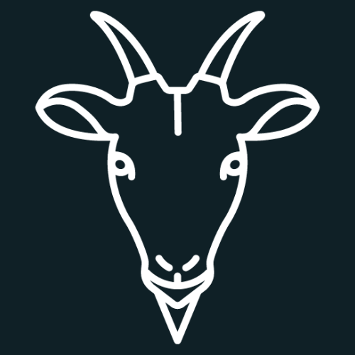

# Goat Bot V2.5 - Unofficials

<p align="center">
   
   <h1 align="center"> Goat Bot V2.5 - Unofficials</h1>
</p>

<p align="center">
   <a href="https://nodejs.org/dist/v16.20.0">
      
   </a>
   
</p>

- [📝 **Introduction**](#-introduction)
- [🙏 **Credits and Acknowledgments**](#-credits-and-acknowledgments)
- [🚧 **Requirements**](#-requirements)
- [📝 **Installation Guide**](#-installation-guide)
- [💡 **How It Works**](#-how-it-works)
- [🛠️ **Creating New Commands**](#-creating-new-commands)
- [💭 **Support**](#-support)
- [📚 **Supported Languages**](#-supported-languages)
- [✨ **Copyright (C)**](#-copyright-c)
- [📜 **License**](#-license)

---

## 📝 **Introduction**

**Goat Bot V2.5 - Unofficials** is a customized version of **Goat Bot V2**, a powerful chatbot designed for group management, task automation, and entertainment features on messaging platforms like Facebook Messenger. This version has been modified to remove dependencies on the Google Drive API, simplifying deployment and eliminating authentication requirements.

**Important Notes**:
- This is **not** the original **Goat Bot V2**. The original version was developed by **[NTKhang](https://github.com/ntkhang03)** and can be found at [https://github.com/ntkhang03/Goat-Bot-V2](https://github.com/ntkhang03/Goat-Bot-V2).
- We strongly encourage you to visit the original repository to support the author and receive official updates.
- The bot uses an unofficial API ([fb-chat-api](https://github.com/ntkhang03/fb-chat-api)), which may result in Facebook account bans due to spam. Use a clone account to avoid risks. **We are not responsible for any issues arising from using this bot.**

---

## 🙏 **Credits and Acknowledgments**

This project is built upon **Goat Bot V2**, an excellent open-source project developed by **NTKhang**. We extend our heartfelt thanks to **NTKhang** for providing a robust platform that allows the community to customize and extend its features.

- **Original Author**: [NTKhang (NTKhang03)](https://github.com/ntkhang03)
- **Original Repository**: [https://github.com/ntkhang03/Goat-Bot-V2](https://github.com/ntkhang03/Goat-Bot-V2)
- **Unofficial API**: [fb-chat-api](https://github.com/ntkhang03/fb-chat-api) (based on [facebook-chat-api](https://github.com/Schmavery/facebook-chat-api))
- **Original License**: [MIT](https://github.com/ntkhang03/Goat-Bot-V2/blob/main/LICENSE)

We are committed to respecting **NTKhang**'s efforts and adhering to the rules outlined in the MIT License, including retaining the copyright notice and not violating usage terms.

---

## 🚧 **Requirements**

- **Node.js**: Version 16.x or higher ([Download](https://nodejs.org/dist/v16.20.0))
- **Programming Knowledge**: Basic understanding of JavaScript, Node.js, and Facebook's unofficial API.
- **Dependencies**: `axios`, `cheerio`, `fs-extra`, `moment-timezone`, `lodash`, `ora`, etc. (automatically installed).

---

## 📝 **Installation Guide**

1. **Clone the repository**:  
   ```bash
   git clone https://github.com/[your-username]/[your-repo].git
   cd [your-repo]
   ```

2. **Install dependencies**:  
   ```bash
   npm install
   ```

3. **Configuration**:  
   - Copy `config.example.js` to `config.js`:  
     ```bash
     cp config.example.js config.js
     ```  
   - Edit `config.js` to add details such as:  
     - Command prefix (`prefix`).  
     - Time zone (`timeZone`).  
     - API keys (if needed, e.g., TinyURL, ImgBB).  

4. **Run the bot**:  
   ```bash
   node index.js
   ```

**Detailed Instructions**:  
- Watch video tutorials from the original project:  
  - On mobile: [YouTube](https://www.youtube.com/watch?v=grVeZ76HlgA)  
  - On VPS/Windows: [YouTube](https://www.youtube.com/watch?v=uCbSYNQNEwY)  
- Written installation guide: [STEP_INSTALL.md](https://github.com/ntkhang03/Goat-Bot-V2/blob/main/STEP_INSTALL.md)

---

## 💡 **How It Works**

The bot uses Facebook's unofficial API to send and receive messages. When a new event occurs (message, reaction, member joining/leaving a group, etc.), the bot processes it through `handlerEvents`. Key functions include:  

- **onStart**: Checks and executes commands when invoked by users.  
- **onChat**: Handles regular messages.  
- **onFirstChat**: Processes the first message in a group since the bot started.  
- **onReaction**: Handles reactions to messages registered in `GoatBot.onReaction`.  
- **onReply**: Handles replies to messages registered in `GoatBot.onReply`.  
- **onEvent**: Handles events like members joining/leaving a group.  
- **handlerEvent**: Runs event commands from the `scripts/events` folder.  

Details on how it works can be found in the [original README](https://github.com/ntkhang03/Goat-Bot-V2#how-it-works).  

**Notes on Goat Bot V2.5 - Unofficials**:  
- This version removes dependencies on the Google Drive API to simplify setup and eliminate authentication requirements.  
- Some features may not work if they rely on Google Drive.  

---

## 🛠️ **Creating New Commands**

To create new commands, follow the instructions from the original project:  
- See the documentation: [DOCS.md](https://github.com/ntkhang03/Goat-Bot-V2/blob/main/DOCS.md)  
- Add command files to the `scripts/cmds/` folder or event files to the `scripts/events/` folder.  

---

## 💭 **Support**

If you encounter issues with the bot, please join the following support channels:  
- **Discord**: [https://discord.com/invite/DbyGwmkpVY](https://discord.com/invite/DbyGwmkpVY) (recommended)  
- **Facebook Group**: [https://www.facebook.com/groups/goatbot](https://www.facebook.com/groups/goatbot)  
- **Messenger**: [https://m.me/j/Abbq0B-nmkGJUl2C](https://m.me/j/Abbq0B-nmkGJUl2C)  
- **Contact me**: Lộc (LocDev) ([GitHub](https://github.com/[your-username]))  

**Note**: Please do not message **NTKhang** or me directly unless requested. Instead, join the support groups for faster assistance.  

---

## 📚 **Supported Languages**

The bot currently supports two languages:  
- `en`: English  
- `vi`: Vietnamese  

To change the language:  
1. Edit the `config.json` file and set the `language` value to `en` or `vi`.  
2. Customize languages in the `languages/`, `languages/cmds/`, and `languages/events/` folders.  

---

## ✨ **Copyright (C)**

- **Original Author**: [NTKhang (NTKhang03)](https://github.com/ntkhang03)  
- **Customized Version Author**: [LocDev](https://github.com/ThanhLoc04)  

---

## 📜 **License**

This project is licensed under the **MIT License**, same as the original **Goat Bot V2**. Please adhere to the following rules:  

- Don't sell the source code.  
- Don't claim the source code as your own.  
- Do not monetize the source code (e.g., buying/selling commands, renting bots, calling for donations).  
- Don't remove/edit the credits (author name) in the source code.  

**Copyright Notice**:  
```
Copyright (C) NTKhang
This program is free software: you can redistribute it and/or modify
it under the terms of the MIT License as published by
the Free Software Foundation, either version 3 of the License, or
(at your option) any later version.
```

See the full license details at [LICENSE](https://github.com/ntkhang03/Goat-Bot-V2/blob/main/LICENSE).# 2.5
# 2.5
